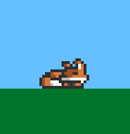

Chrome Dino Run clone called Foxy Trot

<picture>
 
</picture>

Made in the Odin programming language along with the Raylib graphics library.

https://odin-lang.org/

https://www.raylib.com/

Main character art by Ethan's Pixel Art Shop (not included on the github page, can be found here for free)
https://elthen.itch.io/2d-pixel-art-fox-sprites

Version: 
0.0.0 - Fox sprite animation complete 
0.0.1 - Foxy can now jump via space bar! 

Next:
Bounding box for foxy, collision detection and delta time